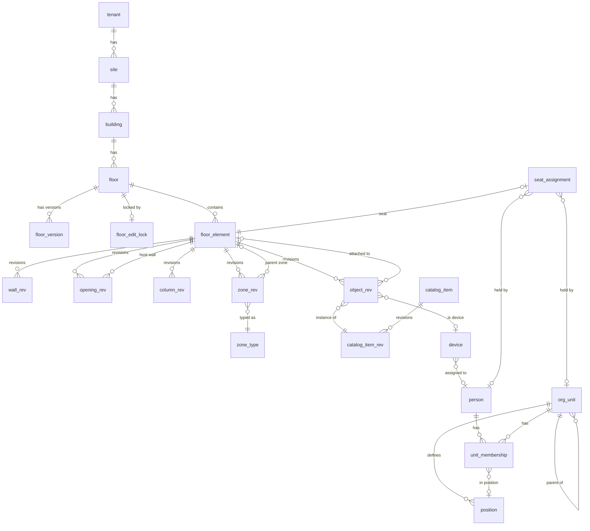

# 0034 — v1 data model (baseline)

- **Date:** 2026-10-08
- **Status:** Accepted (reviewed 2026-10-08, see the last section)
- **Consolidates:** [0003](0003-2026-10-07-tenancy-model.md), [0006](0006-2026-10-07-org-hierarchy-model.md), [0009](0009-2026-10-07-seat-assignment-model.md), [0015](0015-2026-10-08-floor-plan-versioning.md)–[0016](0016-2026-10-08-edit-concurrency.md), [0020](0020-2026-10-08-space-hierarchy.md)–[0022](0022-2026-10-08-device-asset-data.md), [0025](0025-2026-10-08-v1-scope.md)–[0033](0033-2026-10-08-audit-logging.md)

## Conventions
- PK `id uuid` (UUIDv7, app-generated) on every entity table ([0030](0030-2026-10-08-primary-keys.md)).
- Every tenant-owned table has `tenant_id uuid NOT NULL`. Uniqueness constraints include `tenant_id`.
- Lengths are `integer` mm, rotation is `smallint` decidegrees, geometry is PostGIS SRID 0 on a mm grid ([0029](0029-2026-10-08-geometry-representation.md)).
- Timestamps are `timestamptz`, stored in UTC.
- Entity tables have `created_at`, `updated_at` and soft archival via `archived_at` where noted.

## Entity overview

## Tables

### Tenancy & locations
| Table | Key columns | Notes |
|---|---|---|
| `tenant` | `name`, `slug` | Exactly one row in v1 ([0003](0003-2026-10-07-tenancy-model.md)). |
| `site` | `name`, `address`, `time_zone` | `archived_at` |
| `building` | `site_id`, `name`, `code` | `code` unique per site. `archived_at` |
| `floor` | `building_id`, `name`, `level_index`, `elevation_mm`, `default_wall_height_mm`, `origin_x_mm`, `origin_y_mm`, `published_version int` | `level_index` unique per building. `published_version` is NULL until the first publish. |

### Floor versioning & locking ([0015](0015-2026-10-08-floor-plan-versioning.md), [0016](0016-2026-10-08-edit-concurrency.md), [0028](0028-2026-10-08-floor-version-storage.md))
| Table | Key columns | Notes |
|---|---|---|
| `floor_version` | `floor_id`, `version_no`, `state` (`draft`/`published`/`superseded`/`discarded`), `created_by`, `published_by`, `published_at`, `note` | `UNIQUE(floor_id, version_no)`. At most one `draft` per floor (partial unique index). |
| `floor_edit_lock` | PK `floor_id`, `holder_subject`, `acquired_at`, `expires_at` | Heartbeat extends `expires_at`. An expired row counts as free. |

### Floor elements ([0028](0028-2026-10-08-floor-version-storage.md), [0029](0029-2026-10-08-geometry-representation.md), [0032](0032-2026-10-08-architectural-elements.md))
`floor_element` (stable identity): `floor_id`, `kind` (`wall`/`opening`/`column`/`zone`/`object`), `created_at`.

Every `*_rev` table shares: `id`, `element_id → floor_element`, `from_version int`, `to_version int NULL`, plus `EXCLUDE USING gist (element_id WITH =, int4range(from_version, to_version) WITH &&)`.

| Revision table | Kind-specific columns |
|---|---|
| `wall_rev` | `centerline geometry(LineString,0)`, `thickness_mm`, `height_mm` |
| `opening_rev` | `wall_element_id`, `opening_type` (`door`/`window`), `offset_mm`, `width_mm`, `height_mm`, `sill_mm`, `swing` (`left_in`/`left_out`/`right_in`/`right_out`/`sliding`/`none`) |
| `column_rev` | `footprint geometry(Polygon,0)`, `height_mm` |
| `zone_rev` | `name`, `zone_type_id`, `parent_zone_element_id NULL`, `boundary geometry(Polygon,0)` |
| `object_rev` | `catalog_item_rev_id`, `position geometry(PointZ,0)`, `rotation_ddeg`, `label` (e.g. seat code `3-B-12`), `attached_to_element_id NULL`, `device_id NULL`, `allocation_mode NULL` (`assigned`/`bookable`/`unavailable`; required iff the catalog item `is_seat`) |

Spatial GiST indexes on geometry columns, plus partial indexes `WHERE to_version IS NULL`.

### Catalog & devices ([0021](0021-2026-10-08-object-catalog.md), [0022](0022-2026-10-08-device-asset-data.md))
| Table | Key columns | Notes |
|---|---|---|
| `zone_type` | `name`, `is_enclosed`, `color` | Seeded defaults (room, meeting room, wing, pod, core). |
| `catalog_item` | `tenant_id NULL`, `key`, `category`, `name`, `archived_at` | `tenant_id NULL` = built-in item shipped with HSM. |
| `catalog_item_rev` | `item_id`, `rev_no`, `shape` (`box`/`cylinder`/`l_shape`/`model`), `width_mm`, `depth_mm`, `height_mm`, `color`, `model_key NULL`, `is_seat`, `mountable`, `attaches_to_categories text[]`, `footprint_blocks` | Immutable once used. Dimension changes create a new `rev_no`. |
| `device` | `asset_tag NULL`, `serial_number NULL`, `notes`, `assigned_person_id NULL` | `UNIQUE(tenant_id, asset_tag)`. Referenced by `object_rev.device_id`, so a device keeps its identity when moved between floors. |

### People & organization ([0006](0006-2026-10-07-org-hierarchy-model.md), [0023](0023-2026-10-08-primary-unit-rule.md), [0027](0027-2026-10-08-v1-interim-people-and-access.md))
| Table | Key columns | Notes |
|---|---|---|
| `org_unit` | `parent_id NULL`, `name`, `level_label`, `color`, `external_id NULL`, `source` (`manual`/`import`/`ad`), `archived_at` | Single root per tenant. `UNIQUE(tenant_id, external_id)`. |
| `position` | `unit_id`, `title` | |
| `person` | `display_name`, `email`, `title`, `external_id NULL`, `idp_subject NULL`, `source`, `active` | `UNIQUE(tenant_id, external_id)`, `UNIQUE(tenant_id, email)`. `idp_subject` is the Keycloak `sub`, linked on first login. |
| `unit_membership` | PK `(person_id, unit_id)`, `is_primary`, `position_id NULL`, `primary_override` | At most one primary per person (partial unique index). |
| `unit_manager` | PK `(unit_id, person_id)` | Created now, **unused in v1** ([0024](0024-2026-10-08-unit-managers.md), deferred with OpenFGA). |

### Assignment & audit ([0031](0031-2026-10-08-seat-assignment-rules.md), [0033](0033-2026-10-08-audit-logging.md))
| Table | Key columns | Notes |
|---|---|---|
| `seat_assignment` | `seat_element_id` (UNIQUE), `holder_person_id NULL`, `holder_unit_id NULL`, `assigned_at`, `assigned_by`, `note` | `CHECK (num_nonnulls(holder_person_id, holder_unit_id) = 1)` |
| `audit_event` | `occurred_at`, `actor_subject`, `actor_person_id NULL`, `action`, `entity_type`, `entity_id`, `before jsonb`, `after jsonb`, `request_id`, `reason` | Append-only. |

## Invariants validated in the service layer (on save and publish)
1. Zones on a floor are disjoint or strictly nested. A child zone lies inside its parent ([0020](0020-2026-10-08-space-hierarchy.md)).
2. An opening fits inside its host wall ([0032](0032-2026-10-08-architectural-elements.md)).
3. An attached object references an element whose catalog category is in `attaches_to_categories`.
4. Seat labels are unique among visible seats **within a building** (checked at publish).
5. A device is placed at most once across all published floors (checked at publish).
6. Publish conflicts: removed or mode-changed seats with assignments block the publish ([0031](0031-2026-10-08-seat-assignment-rules.md)).
7. A non-mountable object has `z = 0`.

## Review outcome (2026-10-08)
| # | Decision | Alternative rejected | Outcome |
|---|---|---|---|
| A | Trees (`org_unit`, nested zones) use an **adjacency list** (`parent_id`) + recursive CTEs | `ltree` materialized paths | Kept (not contested). Revisit if subtree queries get slow. |
| B | **Separate `device` table** for asset identity, so devices can move across floors | Asset fields on the placed object | Confirmed |
| C | `allocation_mode` is **versioned with the layout** (changed via draft → publish) | Live, unversioned attribute | Confirmed. Taking a broken seat out of service needs a publish. |
| D | Seat **labels unique per building** | Per floor, or per tenant | Confirmed |
| E | Built-in catalog rows live in the DB with `tenant_id NULL`, seeded by migration | Built-ins in code/JSON | Confirmed |
